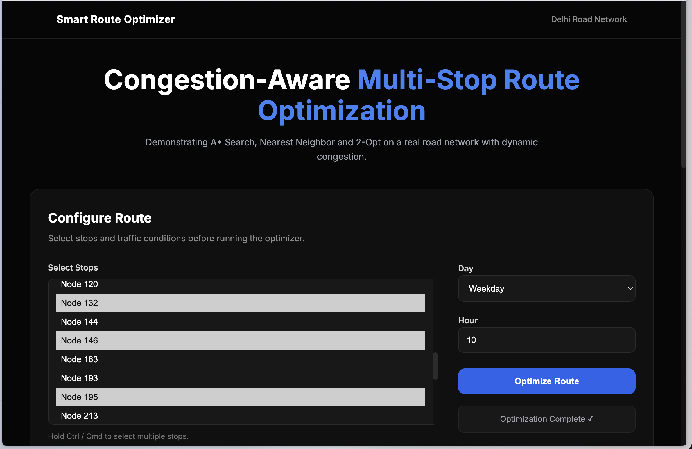
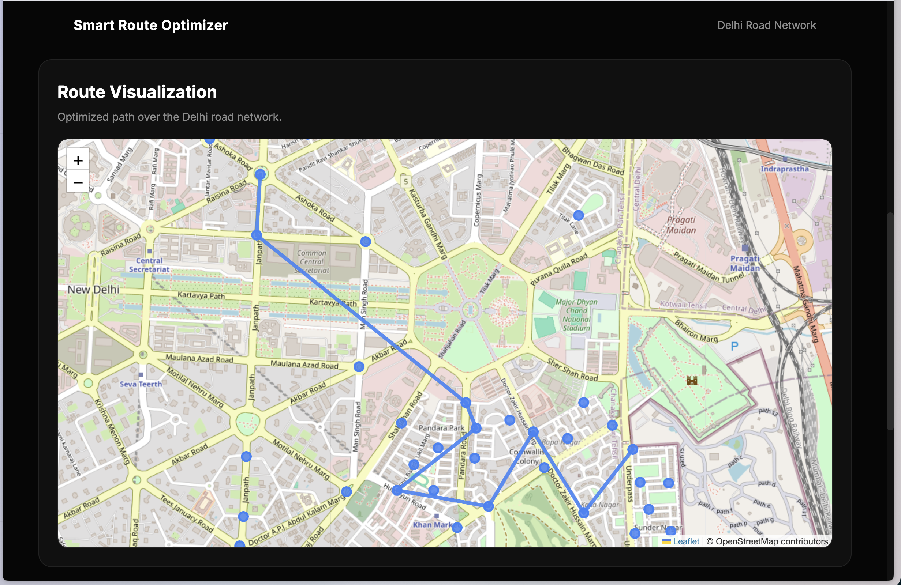
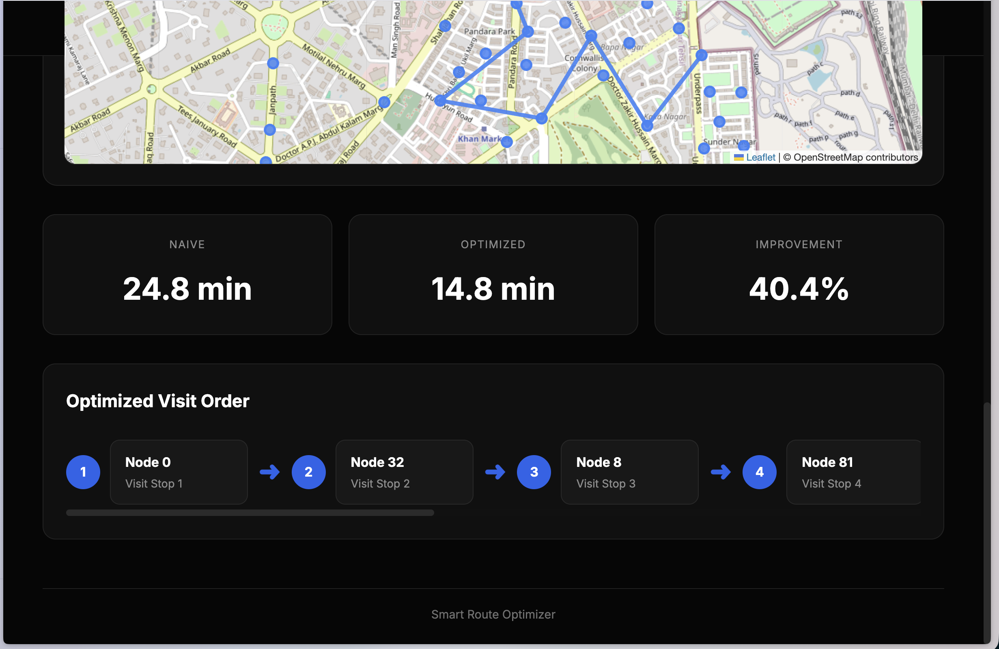

# Smart Route Optimizer

Congestion-aware multi-stop route optimization on a real road network, built with a C++ algorithmic core (A*, nearest-neighbor, 2-opt), a Node/Express backend, SQLite, and a vanilla JS + Leaflet frontend.

## Overview

Given a set of stops, this system computes the optimal visiting order and route — accounting for real road distances *and* time-dependent traffic congestion — and compares it against the naive (input-order) route. It's built on a real OpenStreetMap road network around India Gate, New Delhi.

**Live demo:** select stops on the map, choose a day type and hour, and see the naive vs. optimized route with real time savings.

## Screenshots

<table>
<tr>
<td width="50%"></td>
<td width="50%"></td>
</tr>
<tr>
<td align="center"><sub>Configure stops, day type, and hour</sub></td>
<td align="center"><sub>Optimized route drawn on the real road network</sub></td>
</tr>
</table>

<p align="center">
  
  <br>
  <sub>Naive vs. optimized comparison, with the resulting visit order</sub>
</p>

## Architecture

```
Frontend (EJS + vanilla JS + Leaflet)
        │  REST (JSON)
        ▼
Backend (Node/Express)
   - queries SQLite for graph + congestion data
   - calls C++ optimizer as a subprocess (JSON via stdin/stdout)
   - persists trip history
        │
        ▼
C++ Optimizer Core
   1. A* — congestion-aware shortest path between any two nodes
   2. Nearest-neighbor — initial visiting order for all stops
   3. 2-opt — local search improvement over that order
        ▲
        │ reads from
SQLite Database
   nodes, edges, congested_areas, traffic_patterns, trips
        ▲
        │ one-time, offline
data/build_graph.py + data/generate_congestion.py
   - OSMnx: real road network extraction
   - Synthetic (seeded) congestion zones and time-based patterns
```

The dataset is built **once, offline**. The live app never calls external APIs — every request is a DB lookup plus C++ computation. This avoids live rate-limit dependency and keeps the app fast and reproducible.

## Why these algorithms

- **A\* with a haversine heuristic**: finds the congestion-aware shortest path between any two nodes on the road graph. The heuristic biases search toward the goal instead of exploring uniformly in all directions (Dijkstra's behavior), which matters once congestion zones create uneven edge weights across multiple possible routes.
- **Nearest-neighbor**: a greedy heuristic for building an initial stop-visiting order. Fast, but not optimal — it can get locally stuck in a suboptimal order.
- **2-opt**: local search that iteratively reverses segments of the route if doing so reduces total time, correcting nearest-neighbor's mistakes.
- **Why not exact TSP?** Exact TSP (e.g., Held-Karp DP) is O(n²·2ⁿ) — infeasible to compute per-request as stop counts grow. Nearest-neighbor + 2-opt is a standard, well-understood tradeoff: near-optimal results in polynomial time.

## Dataset

| Property | Value |
|---|---|
| Location | India Gate area, New Delhi (1.5km radius) |
| Total road nodes | 374 |
| Total road edges | 1,174 (bidirectional) |
| Stop candidates | 40 (12 major / 18 medium / 10 minor junctions, ranked by degree, min. 150m spacing) |
| Congestion zones | 40 (scattered across all road nodes, not just stops) |
| Traffic patterns | 120 (weekday morning/evening rush + weekend, per zone) |

**Data sources:**
- Road network: [OSMnx](https://osmnx.readthedocs.io/) extraction from OpenStreetMap (real intersections, real road distances and estimated travel times)
- Congestion zones/patterns: seeded/simulated — 40 zones sampled from real road nodes, assigned low/medium/high severity tiers with time-based multipliers based on typical urban traffic patterns. **Not live traffic data.** A production version would integrate a live traffic API (e.g., TomTom Traffic API) instead.
- Edges are treated as bidirectional (one-way street restrictions simplified) to guarantee route connectivity across any stop selection.

## Results

Naive (input order) vs. optimized (nearest-neighbor + 2-opt) route time, across varied stop counts and traffic conditions:

| Scenario | Stops | Day | Hour | Naive (min) | Optimized (min) | Improvement |
|---|---|---|---|---|---|---|
| A | 5 | Weekday | 9 | 8.7 | 8.7 | 0.0% |
| B | 8 | Weekday | 10 | 38.9 | 13.6 | 65.0% |
| C | 10 | Weekday | 18 | 32.6 | 17.9 | 45.0% |
| D | 6 | Weekend | 14 | 20.1 | 12.7 | 36.8% |
| E | 12 | Weekend | 19 | 38.3 | 20.9 | 45.4% |

**Average improvement across scenarios with room to optimize: ~48%.** Scenario A shows 0% improvement — with only 5 stops, the naive input order happened to already be near-optimal for that particular combination, which is expected and realistic (not every input has room for improvement).

## Tech stack

- **Algorithms/core**: C++17, CMake, [nlohmann/json](https://github.com/nlohmann/json)
- **Backend**: Node.js, Express, better-sqlite3
- **Frontend**: EJS, vanilla JS, Leaflet.js
- **Database**: SQLite
- **Data pipeline**: Python, OSMnx, pandas

## Setup

```bash
# 1. Build the C++ optimizer
cd optimizer
mkdir -p build && cd build
cmake .. && make
cd ../..

# 2. Build the dataset (one-time)
python3 data/build_graph.py
python3 data/generate_congestion.py
python3 data/load_db.py

# 3. Run the backend (serves frontend + API on same port)
cd backend
npm install
npm start
```

Open `http://localhost:3000/`.

## Limitations & future work

- Congestion data is seeded/simulated, not live — noted above, would integrate a real traffic API in production
- One-way street restrictions are ignored (edges treated as bidirectional) to guarantee connectivity across arbitrary stop selections
- Congestion detection uses a simple radius check around zone centroids rather than real road-polyline intersection
- Exact TSP (e.g., bitmask DP for small n) could replace the heuristic for very small stop counts where optimality matters more than speed
- Precomputing full distance matrices for the whole stop-candidate set (rather than per-request) could reduce latency further for high-traffic use

## Project structure

```
route-optimiser/
├── data/              # dataset build scripts (OSMnx, congestion generation, DB loader)
├── optimizer/         # C++ core (A*, nearest-neighbor, 2-opt)
├── backend/           # Express server, API routes, SQLite, EJS frontend
├── assets/            # README screenshots
└── README.md
```